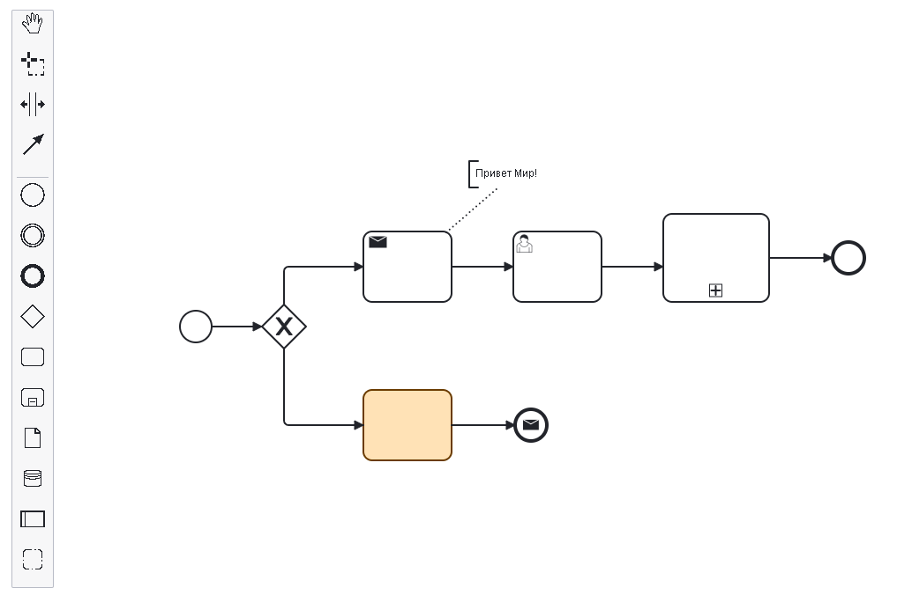

# Easy BPMN

Простой сервис с интегрированной библиотекой [BPMN-JS](https://github.com/bpmn-io/bpmn-js.git). Предоставляет основной набор инструментов для работы с данной библиотекой.

## О сервисе

Приложение предоставляет функционал для редактирования диаграмм бизнес-процессов нотации BPMN 2.0.




## Сборка

Сборка происходит при построении docker-образа через dockerfile.
Для запуска сборки образа необходимо запустить

```bash
docker-build.sh
```

Для запуска контейнера необходимо запустить

```bash
docker-run.sh
```

Будет создан контейнер с открытым портом **8080**.
